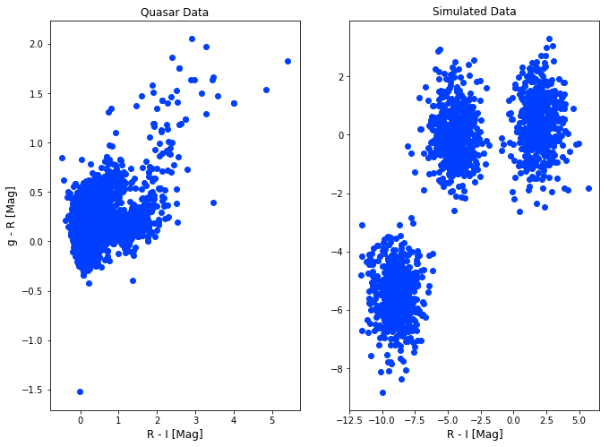
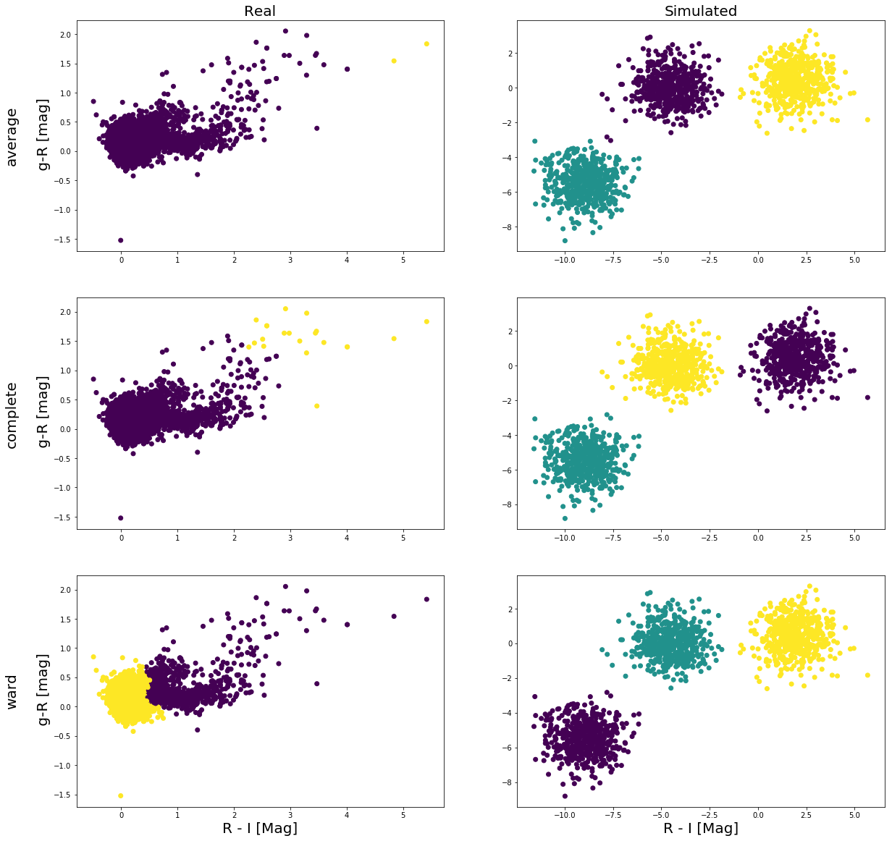
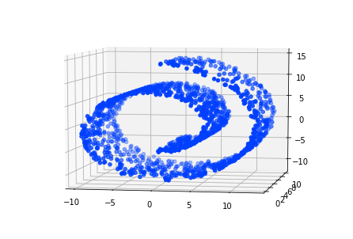
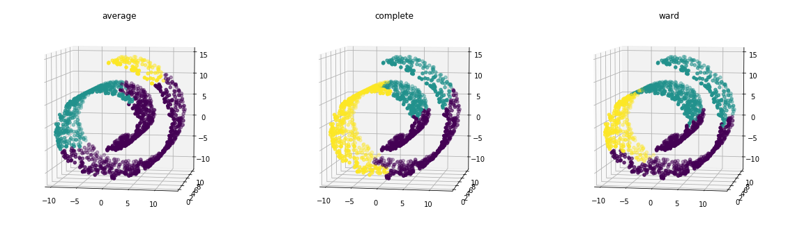
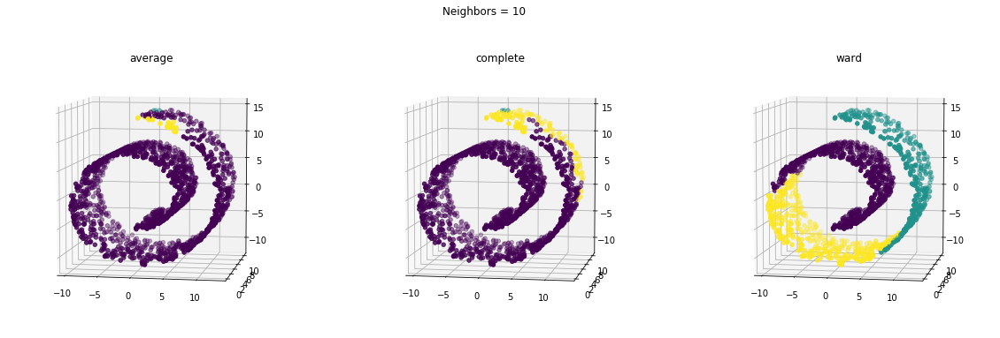
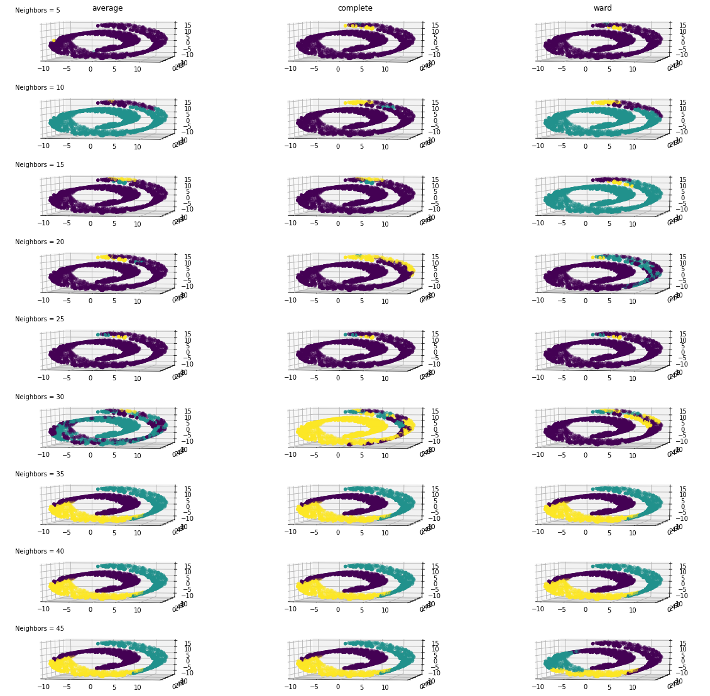

```python
import pandas as pd 
import numpy as np 
import matplotlib.pyplot as plt 
from sklearn.model_selection import KFold
from sklearn.cluster import KMeans
from sklearn.cluster import AgglomerativeClustering
from sklearn.neighbors import kneighbors_graph
import random 
from random import randint 
from sklearn.datasets import make_blobs, make_swiss_roll
from astroML.datasets import fetch_dr7_quasar
plt.style.use("seaborn-bright")
```
Due by 2 PM on Monday May 13th

Python modules you'll want to use:
from sklearn.cluster import AgglomerativeClustering
from sklearn.neighbors import kneighbors_graph

----
 - Use the same two data sets with at least two features from last week:
    - One that has elongated clusters or irregular shapes in the distribution. It should be easy to find a real astrophysical data set like this.
    - One that is convex and isotropic with blobs of approximately equal numbers of points. You'll probably have to make this yourself.

```python
# Real Data
data = fetch_dr7_quasar()
u_gr = data['mag_g'] - data['mag_r']
u_ri = data['mag_r'] - data['mag_i']
index = np.where(u_gr > -15)
u_gr = u_gr[index]
u_ri = u_ri[index]

realX = np.zeros([len(u_gr),2])
realX[:,0] = u_gr
realX[:,1] = u_ri
realX = np.unique(realX,axis=0)
randos = [np.random.randint(0,len(realX)) for i in range(10000)]
realX = realX[randos]

# Fake Data
n_samples = 1500
random_state = 170
num = 10
nnum = 5

X, y = make_blobs(n_samples=n_samples, random_state=random_state)
```


```python
f, (ax,bx) = plt.subplots(1,2,figsize=(11,8))
ax.scatter(realX[:,0],realX[:,1])
ax.set_ylabel("g - R [Mag]",size="large")
ax.set_xlabel("R - I [Mag]",size="large")
ax.set_title("Quasar Data",size="large")

bx.scatter(X[:,0],X[:,1])
bx.set_xlabel("R - I [Mag]",size="large")
bx.set_title("Simulated Data",size="large")
plt.savefig("Data.png")
```





 - Run the `AgglomerativeClustering` module on each data set with each of the different linkage criteria. Plot the data sets color coded by the cluster labels.


```python
linkage = ["average","complete","ward"]

clustering_real = [AgglomerativeClustering(linkage= link ).fit(realX) for link in linkage]
clustering_fake = [AgglomerativeClustering(linkage= link,n_clusters=3 ).fit(X) for link in linkage]
```


```python
f, axes = plt.subplots(3,2,figsize=(20,20))

for i in range(3):
    axes[i,0].scatter(realX[:,0],realX[:,1],c=clustering_real[i].labels_)
    axes[i,1].scatter(X[:,0],X[:,1],c=clustering_fake[i].labels_)
    axes[i,0].set_ylabel(linkage[i]+"\n\n g-R [mag]",fontsize=20)
axes[0,0].set_title("Real",fontsize=20)
axes[0,1].set_title("Simulated",fontsize=20)
axes[2,0].set_xlabel("R - I [Mag]",fontsize=20)
axes[2,1].set_xlabel("R - I [Mag]",fontsize=20)
plt.show()    
```





 - Describe in a few sentences the differences in the cluster labels based on what you know about the linkage criteria.
 
 For clean, simple data, the linkage criteria doesn't matter too much for identifying clusters. Although, "complete" and "ward" still do better than "average" here just by observing the two points above the left most cluster. For real data, this is no longer true and "ward" by far outperforms "average" and "complete"

 - Make a `structured` dataset. It is fun to use some subset of either the S curve or Swiss roll datasets here: https://scikit-learn.org/stable/datasets/index.html#generators-for-manifold-learning


```python
SwissX, _ = make_swiss_roll(n_samples=1500,noise=0.05)
SwissX[:,1] *= .5
```


```python
fig = plt.figure()
ax = p3.Axes3D(fig)
ax.scatter(SwissX[:,0],SwissX[:,1],SwissX[:,2])
ax.view_init(7,-80)
```





 - Run the `AgglomerativeClustering` module on each data set with each of the different linkage criteria. Plot the data sets color coded by the cluster labels.


```python
clustering_swiss = [AgglomerativeClustering(linkage= link,n_clusters=3 ).fit(SwissX) for link in linkage]

fig = plt.figure(figsize=(20,6))
for i in range(1,4):
    ax = fig.add_subplot(1,3,i,projection='3d')
    ax.scatter(SwissX[:,0],SwissX[:,1],SwissX[:,2],c=clustering_swiss[i-1].labels_)
    ax.view_init(7,-80)
    ax.set_title(linkage[i-1])
```





- Incorporate connectivity information using kneighbors_graph. 


```python
connectivity = kneighbors_graph(SwissX,n_neighbors=10,include_self=False)

clustering_swiss_connect = [AgglomerativeClustering(linkage= link,n_clusters=3,connectivity=connectivity ).fit(SwissX) for link in linkage]

fig = plt.figure(figsize=(20,6))
for i in range(1,4):
    ax = fig.add_subplot(1,3,i,projection='3d')
    ax.scatter(SwissX[:,0],SwissX[:,1],SwissX[:,2],c=clustering_swiss_connect[i-1].labels_)
    ax.view_init(7,-80)
    ax.set_title(linkage[i-1])
fig.suptitle("Neighbors = 10")
```


    Text(0.5, 0.98, 'Neighbors = 10')





- Try a range of different numbers of neighbors (n_neighbors).


```python
connectivity = [kneighbors_graph(SwissX,n_neighbors=i,include_self=False) for i in range(5,50,5)]

clustering_swiss_connect = [AgglomerativeClustering(linkage= link,n_clusters=3,connectivity=connect ).fit(SwissX) for link in linkage for connect in connectivity]

fig = plt.figure(figsize=(20,20))
n_neigh = 5
for i in range(1,28):
    ax = fig.add_subplot(len(range(5,50,5)),3,i,projection='3d')
    ax.scatter(SwissX[:,0],SwissX[:,1],SwissX[:,2],c=clustering_swiss_connect[i-1].labels_)
    ax.view_init(7,-80)
    if np.isin(i,[1,2,3]):
        ax.set_title(linkage[i-1])
    if np.isin(i,np.arange(1,28,3)):
        ax.text2D(0.05,0.95,"Neighbors = " + str(n_neigh),transform=ax.transAxes)
        n_neigh += 5
#plt.tight_layout()
```





 - Describe in a few sentences the differences with different numbers of neighbors. What trends do you see?
 
 
 Clustering gets better the more neighbors you have but there's a limit to that. The very bottom right plot where neighbors = 45 for "ward" actually gets worse so choosing either a small or large amount of neighbors isn't ideal. 

 - Time the `fit(X)` step with and without connectivity. (Keep the data set, number of neighbors, and linkage criteria the same.)


```python
import time
```


```python
start = time.time()
no_connect = AgglomerativeClustering(linkage= "ward",n_clusters=3).fit(SwissX) 
end = time.time()
print("Without connectivity: " + str(end-start) + " s has elapsed.")


start = time.time()
connectivity = kneighbors_graph(SwissX,n_neighbors=35,include_self=False)
connect = AgglomerativeClustering(linkage= "ward",n_clusters=3,connectivity=connectivity ).fit(SwissX) 
end = time.time()
print("With connectivity: " + str(end-start) + " s has elapsed.")
```

    Without connectivity: 0.09470987319946289 s has elapsed.
    With connectivity: 0.29720592498779297 s has elapsed.
    


```python

```
